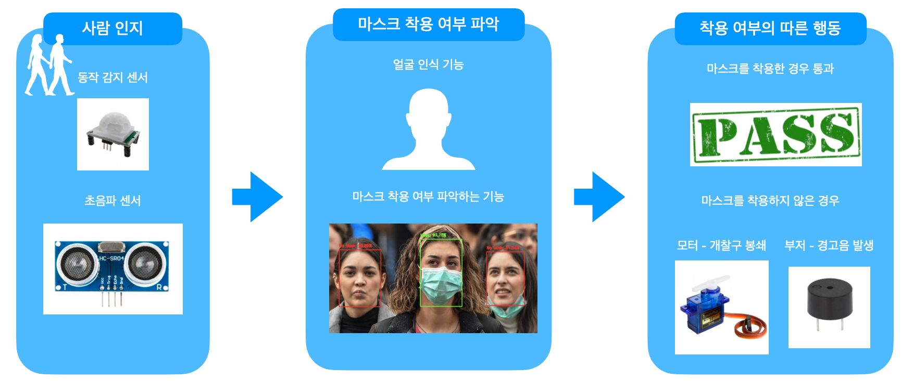

# PythonAI
중앙대학교 하계 단기 특강

## Day 01: 라즈비안 및 GPIO 학습
### 라즈비안 운영체제 학습 및 설치
### GPIO를 통한 여러 도구 학습
[Input]  
    
- 동작감지 센서  
- 초음파 센서  
- 온도 센서  

[Output]  

- LED  
- 서브모터  
- LCD  
- 부저

### SketchUp을 이용한 Car 3D modeling

## Day 02: 간단한 홈 IoT 구축
### Flask로 웹서버 구축
html, css  
flask  

### 웹브라우저와 연동을 통한 GPIO 제어
CSS 응용 홈 IoT

## Day 03: 인공지능 어시스턴스 및 스마트 미러 제작
### 음성인식
마이크와 스피커 제어  
음성인식 기술

### Open API: 네이버 API - 파파고
사진을 통한 연예인 추측 API  
얼굴 분석 API
파파고 번역 API

### Google Assistant
[Google Assistant](https://assistant.google.com/explore?hl=ko-KR)  

### Smart Mirror 제작 및 인공지능 어시스턴스 구축
스마트 미러 만들기  
[Magic Mirror](https://magicmirror.builders/)
config

## Day 04: OpenCV
### RPI 카메라 제어
### OpenCV
#### haar
https://docs.opencv.org/4.4.0/db/d28/tutorial_cascade_classifier.html  
#### Face recognition
### 실습: 마스크 착용 여부 파악하는 프로그램
https://github.com/chandrikadeb7/Face-Mask-Detection  

## Day 05: 자율주행자동차
### GPIO를 활용한 자동차 제작
- 모터제어
- 센서 제어
    - 초음파 센서
    - 행동 감지
    - 카메라 

## Day 06: 해커톤
### 지하철 마스크 착용 여부 판단 프로젝트
문제: 어떻게 하면 마스크 미착용자의 지하철 탑승을 막을 것인가?  
해결: 개찰구에서 마스크 착용 여부를 파악하여 미착용자는 개찰구를 통과할 수 없게 만들자!  
  

